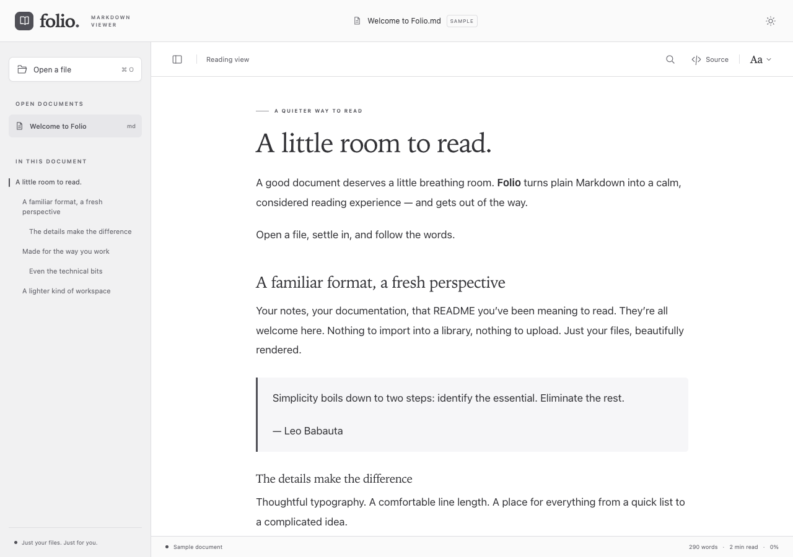

<div align="center">
  
  <h1>Folio</h1>
  <p><strong>A little room to read.</strong></p>
  <p>A lightweight Markdown viewer for Mac, Windows, and Linux.<br>Beautiful typography. Ordinary files. Your favorite editor, one click away.</p>
  <p><a href="https://github.com/woodcreeper/folio/releases">Downloads</a> · <a href="#install">Install</a> · <a href="docs/DEVELOPMENT.md">Build from source</a> · <a href="https://github.com/woodcreeper/folio/issues">Feedback</a></p>
  <p><a href="https://github.com/woodcreeper/folio/actions/workflows/build.yml"></a> <a href="LICENSE"></a></p>
</div>



## Read first. Edit where you like.

Open a Markdown file and get straight to the words. Folio keeps your source untouched and gives it comfortable spacing, readable code, and a clear outline. When you want to make a change, **Open in Editor** sends the same file to your chosen editor. Save there, and Folio refreshes while keeping your place.

- **Four reading styles:** Folio, VS Code-inspired, iA Writer Classic-inspired, and GitHub-inspired.
- **Your preferred appearance:** light, dark, or system, with adjustable text size and remembered settings.
- **Easy navigation:** a heading outline, document search, and a read-only source view.
- **Markdown essentials:** tables, highlighted code, task lists, footnotes, and local raster images.
- **Mac Quick Look:** an included native extension for Finder’s Space-bar preview.
- **Local by design:** no accounts, uploads, or analytics. Built with Tauri and platform webviews.

## Install

**Folio is an early preview.** Get packages from the [Releases page](https://github.com/woodcreeper/folio/releases). The release workflow produces the following files after all platform builds and automated tests pass. If a release is still building, you can [build from source](docs/DEVELOPMENT.md).

| Computer | Download | Requirements |
| --- | --- | --- |
| Mac — Apple Silicon or Intel | `Folio-macOS-universal.zip` | macOS 12 or later |
| Windows PC — x64 | `Folio_<version>_x64-setup.exe` | Windows 10 or 11; WebView2 |
| Ubuntu / Debian — x64 | `Folio_<version>_amd64.deb` | Ubuntu 22.04+ or a compatible Debian-based desktop with WebKitGTK 4.1 |
| Other Linux desktops — x64 | `Folio_<version>_amd64.AppImage` | A compatible glibc-based desktop; see Linux notes below |

Filenames may vary slightly; choose the matching extension in the release assets. Preview builds are **not Developer ID-signed/notarized on Mac or publisher-signed on Windows**. Mac bundles are signed ad hoc for bundle integrity. Operating systems may show security warnings. Managed computers may require administrator approval. Checksums are included as `SHA256SUMS.txt`.

### macOS

1. Download and unzip `Folio-macOS-universal.zip`.
2. Drag **Folio.app** into **Applications**, then open it.
3. If macOS blocks it as an unidentified developer, review the warning. If you trust this release, use **System Settings → Privacy & Security → Open Anyway**, then confirm. See [Apple’s guidance](https://support.apple.com/en-us/102445).
4. Open a Markdown file with **⌘O**, or drag it into Folio.

**Space-bar preview:** open Folio once, then enable its Quick Look extension in System Settings if needed. On recent macOS versions, look under **General → Login Items & Extensions → Quick Look**; older versions may use **Privacy & Security → Extensions → Quick Look**, or **System Preferences → Extensions** on macOS Monterey. Select a Markdown file in Finder and press **Space**. Other Markdown Quick Look extensions may take precedence.

**Double-click to open in Folio:** select a `.md` file in Finder, choose **Get Info → Open with → Folio → Change All**. Folio does not replace your current default automatically.

Quick Look is still experimental: its native renderer and bundle checks pass, but Finder integration needs broader real-machine testing. See [Quick Look troubleshooting and acceptance checks](macos/README.md). Quick Look uses the default Folio reading style and shows placeholders for images.

### Windows

1. Download the **x64 `-setup.exe`** from Releases and run it.
2. Follow the installer. It can install Microsoft Edge WebView2 if the runtime is missing; that step needs an internet connection.
3. Open **Folio** from Start, then press **Ctrl+O** or drag in a Markdown file.

An unsigned preview may trigger SmartScreen. Check that the file came from this repository’s release; if you trust it and Windows offers the option, choose **More info → Run anyway**. Some Windows 11 configurations with Smart App Control may block unsigned previews altogether. See [Microsoft’s SmartScreen guidance](https://learn.microsoft.com/en-us/windows/apps/package-and-deploy/smartscreen-reputation).

To use Folio for double-clicks, right-click a `.md` file, choose **Open with → Choose another app**, and select Folio as the default. Windows ARM64 packages are not currently provided.

### Linux

On Ubuntu or Debian, download the `.deb`, then run the following from its download folder (substitute the actual filename):

```sh
sudo apt install ./Folio_0.1.0_amd64.deb
```

This installs the package and resolves its system dependencies. Launch Folio from your application menu.

For an AppImage, download the `.AppImage`, then make it executable and run it:

```sh
chmod +x Folio_0.1.0_amd64.AppImage
./Folio_0.1.0_amd64.AppImage
```

AppImages are built on Ubuntu 22.04 and are not guaranteed to work on every distribution. If FUSE is unavailable, try `./Folio_0.1.0_amd64.AppImage --appimage-extract-and-run`. See [Tauri’s AppImage compatibility notes](https://v2.tauri.app/distribute/appimage/). Linux ARM64 packages are not currently provided.

Use your file manager’s **Open With** settings to associate Markdown with Folio. The `.deb` installs a desktop entry; a standalone AppImage may need manual desktop integration. Finder-style Space-bar preview is a macOS feature only.

### Omarchy / Arch Linux

Omarchy support is being investigated. The Linux AppImage is a candidate, and an [experimental native Arch package and Wayland check](packaging/arch/README.md) are saved in this repository. Neither has been verified on an actual Omarchy desktop yet. We are also checking whether Omarchy’s existing tools or plugin model are a better fit before adding an integration.

## Make it yours

Open **Appearance** (the **Aa** button) to choose a reading style, theme, or text size. The styles use local system fonts, so details vary by platform. They are original CSS inspired by familiar reading experiences, not exact replicas or affiliated products.

Choose **Open in Editor** to pick your editor once. On Mac, select its `.app`; on Windows, its `.exe`; on Linux, its executable. Change that choice under **Appearance → External Editor**. Folio watches the current file, including editors that save by replacing it, and preserves the visible paragraph when it refreshes. Source view keeps its proportional scroll position.

| Action | Mac | Windows / Linux |
| --- | --- | --- |
| Open a file | ⌘O | Ctrl+O |
| Find in document | ⌘F | Ctrl+F |
| Open in your editor | ⌘⇧E | Ctrl+Shift+E |
| Increase / decrease text size | ⌘+ / ⌘− | Ctrl+ / Ctrl+− |
| Reset text size | ⌘0 | Ctrl+0 |

## What works today

Folio reads UTF-8 `.md`, `.markdown`, `.mdown`, and `.mkd` files up to **10 MiB**. The desktop app displays local raster images within the document’s directory and its child directories. For safety and offline reading, remote images, raw HTML, SVG, and executable links stay inert. File contents are not saved in preferences.

Built-in editing, annotations, Markdown-to-Markdown navigation, Mermaid, math, and mobile apps are future work. The renderer and document model are separate from the UI so editing can be added without replacing the reading foundation.

The Mac app has been exercised locally. CI builds packages and runs Rust tests on all three desktop platforms, plus browser interaction tests on Linux. Automated builds do not replace hands-on testing of Windows/Linux installation, external editors, and desktop integration. Please [report issues](https://github.com/woodcreeper/folio/issues) with your OS version and a minimal non-private sample.

## Build, contribute, or explore

See [development and platform build instructions](docs/DEVELOPMENT.md), [architecture](docs/ARCHITECTURE.md), and the [macOS extension notes](macos/README.md).

```sh
git clone https://github.com/woodcreeper/folio.git
cd folio
npm ci
npm run desktop
```

Install a current Node.js 22 or 24 LTS release, Rust, and the platform dependencies first. Browser-only development is available with `npm run dev`.

Built with [Tauri](https://tauri.app/), [markdown-it](https://github.com/markdown-it/markdown-it), [highlight.js](https://highlightjs.org/), TypeScript, and Swift. Reading styles take inspiration from [VS Code](https://github.com/microsoft/vscode/blob/main/extensions/markdown-language-features/media/markdown.css), [iA Writer Classic](https://ia.net/writer/support/preview/templates), and [GitHub Primer](https://github.com/primer/css/tree/main/src/markdown).

[MIT licensed](LICENSE). © 2026 David La Puma. Dependencies retain their respective licenses.
