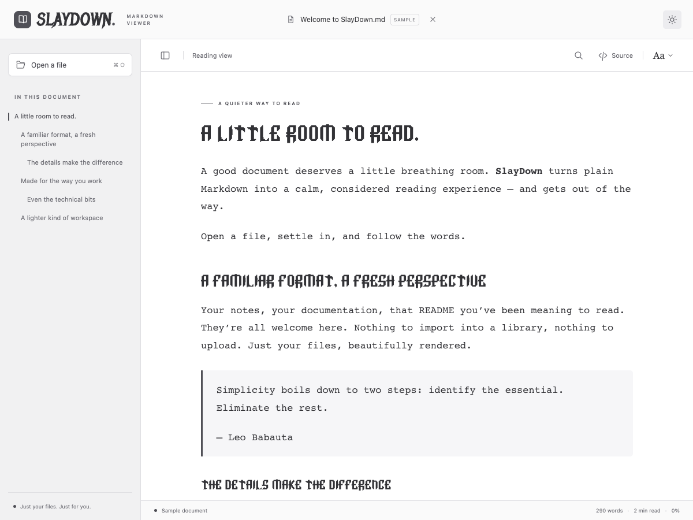

# Bundled fonts

SlayDown loads both fonts from its own packaged assets. No external font requests or system-wide installation are needed.

## Omarchy

Used for headings in the optional **Omarchy** reading style. This is a unicase display face (lowercase letters look like capitals); body text uses the system monospace stack for comfortable reading. Quick Look keeps its neutral default style.

- Author: Mark Cuda. A fan project, not affiliated with Omarchy or 37signals.
- Source: https://github.com/markcuda/Omarchy-Font
- Pinned commit: `cddbc3eaa86f982e6301c162d6ad25555411f508`
- File: `src/assets/fonts/Omarchy.ttf` (unmodified)
- SHA-256: `5d9f768e648ea2f37bba45de4b71c685e15bf74583492295bc6660ea09010e97`
- [MIT license](../public/licenses/Omarchy-LICENSE.txt)
- Upstream credits: Omarchy is by DHH and 37signals; Delta Corps Priest 1 is by CoSMiC cHiLD. The Omarchy name and wordmark remain theirs.

## Metal Mania

Used for SlayDown’s wordmark in the app and current sharing card.

- Author: Open Window / Dathan Boardman.
- Source: https://github.com/google/fonts/tree/main/ofl/metalmania
- Pinned commit: `b392a58e335dbda983fd21ccc491ea1919633374`
- File: `src/assets/fonts/MetalMania-Regular.ttf` (unmodified)
- SHA-256: `4b95f0e55b291990c26a7b68818b20c1b728a8be05a34982b7bb4736c46c19ea`
- [SIL Open Font License 1.1](../public/licenses/MetalMania-OFL.txt)

